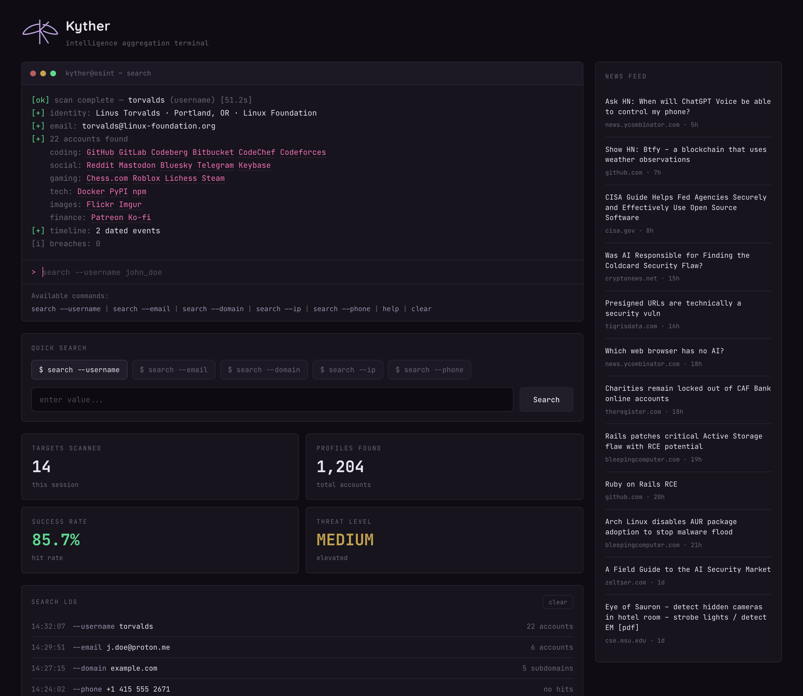

<div align="center">


# Kyther

**intelligence aggregation terminal** — a plugin-based OSINT orchestration engine


</div>

Seed Kyther with an entity — a **username, email, domain, IP, phone, person, or
company** — and it runs every compatible analyzer concurrently, then *pivots* on
what it discovers (username → email → domain, domain → IPs → ASNs, …) up to a
configurable depth. That entity-correlation loop is what makes it an
orchestrator rather than a one-shot lookup — all behind a terminal-style console.



---

## ✦ Features

- **Terminal console** — `search --username <x>` (or `--email`, `--domain`, `--ip`, `--phone`), with `help` and `clear`; results stream back as colored terminal output.
- **18 analyzers, one engine** — username sweeps, profile enrichment, email discovery, breach checks, infra recon, phone intel, and more — merged and deduplicated.
- **Entity pivoting** — a discovered email is re-scanned, a domain expands to its IPs and ASNs, correlated into one result.
- **Live dashboard** — targets scanned, profiles found, success rate, and a threat level that reacts to breaches/accounts found.
- **Persistent search log** + a **Hacker News security feed**.
- **Safety built in** — an SSRF guard blocks private/metadata targets; opt-in heavy analyzers are off by default.

## ⚡ Quick start

```bash
git clone https://github.com/Ammu-yuu/Kyther.git
cd Kyther
python3 -m venv .venv && source .venv/bin/activate
pip install -r requirements.txt

uvicorn kyther.api:app --port 8099
# open http://127.0.0.1:8099
```

Enable opt-in analyzers (account-enumeration / keyed) via env vars:

```bash
OSINT_ENABLE_HOLEHE=1 uvicorn kyther.api:app --port 8099
```

## ⌨ The console

| Command | Does |
|---|---|
| `search --username <handle>` | sweep ~700 sites (WhatsMyName + Sherlock) + enrich + find emails |
| `search --email <addr>` | Gravatar, GitHub pivot, breach checks, Holehe* |
| `search --domain <host>` | DNS, RDAP, crt.sh, HTTP fingerprint, Shodan InternetDB |
| `search --ip <addr>` | geolocation, RDAP, open ports / CVEs |
| `search --phone <number>` | offline carrier / region / line-type intel |
| `help` · `clear` | usage · reset the terminal |

## 🖥 CLI

Every analyzer is also scriptable from the terminal:

```bash
python -m kyther.cli scan example.com --depth 2
python -m kyther.cli scan someone@example.com --json
python -m kyther.cli sherlock SakuraSnowAngelAiko   # Sherlock-only username check
python -m kyther.cli holehe test@example.com        # Holehe-only email check
python -m kyther.cli list                           # registered analyzers
```

## 🔌 Analyzers

| Input | Analyzers |
|-------|-----------|
| **username** | WhatsMyName (719 sites) · Sherlock (413) · profile enrichment (GitHub/Keybase/Reddit/HN/Instagram) · GitHub-commit emails |
| **email** | Gravatar · GitHub → email pivot · Holehe\* · HIBP\* · EmailRep\* |
| **domain / IP** | DNS · RDAP · crt.sh · HTTP probe · Shodan InternetDB · IP geolocation · Hunter\* |
| **phone** | offline `phonenumbers` intelligence |
| **company** | SEC EDGAR full-text search |
| **person** | investigative search links |

`*` = needs a free key or an opt-in flag; **off by default**.

## 🧠 How it works

```
seed entity ─► orchestrator ─► [analyzers accepting this type] ─► findings
                    ▲                                              │
                    └──────────── discovered entities ◄────────────┘
                              (depth-limited BFS pivot)
```

- **`kyther/core/`** — entity model, plugin registry, async pivot engine, SSRF guard.
- **`kyther/analyzers/`** — one file per source. Add a plugin by dropping a module here and listing it in `__init__.py`.
- **`kyther/api.py`** — FastAPI service (`/api/scan`, `/api/news`, `/api/analyzers`) + the console.
- **`kyther/web/index.html`** — the self-contained Kyther terminal UI.

## ⚖ Scope & ethics

Kyther uses only **public, no-auth data** (or an optional bring-your-own key you
supply). No auth bypass, no paywalled scraping, no captcha-solving. Account
enumeration and email-registration checks are **opt-in**. Use it only against
targets you're authorized to investigate — authorized security research, CTFs,
and education.

## Design system

Terminal/data content in **JetBrains Mono**, the brand title in **Quicksand**.
Palette: page `#0f0d13`, panels `#17141d`, borders `#2a2532`, accent `#f472b6`
(reserved for the prompt, cursor, and match tags), success `#5fd88f`.
