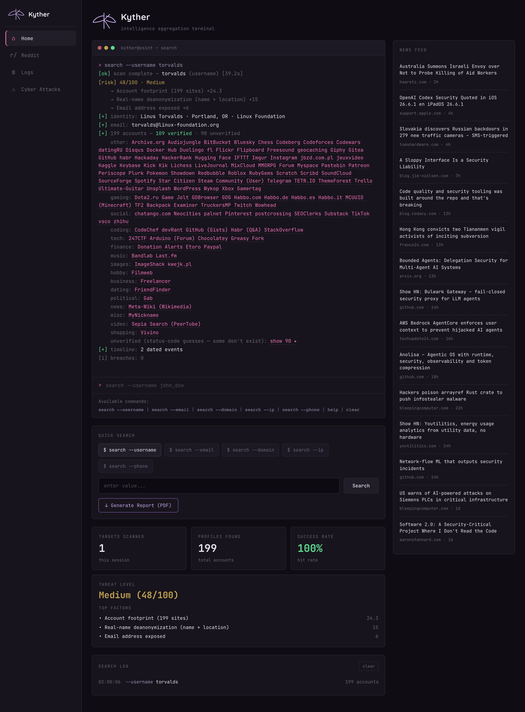
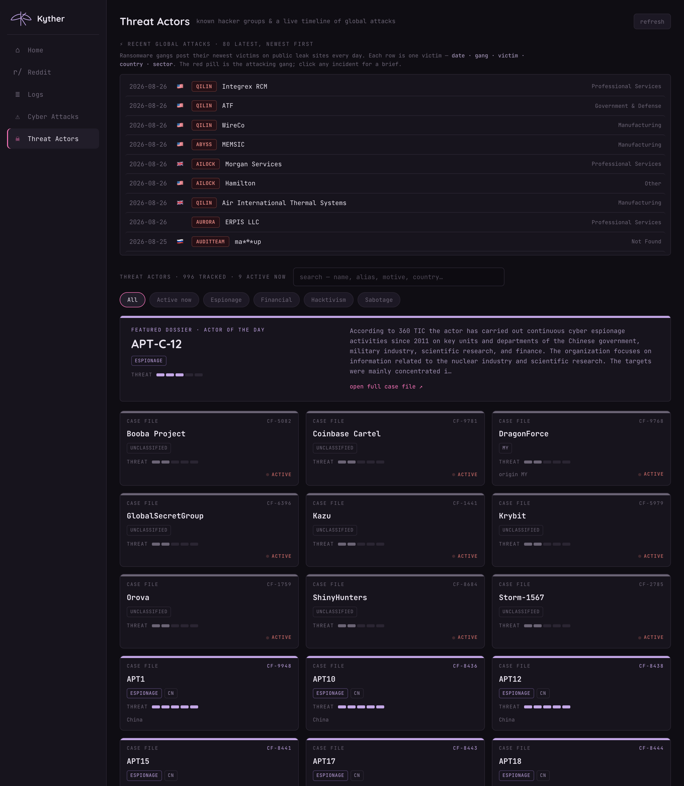
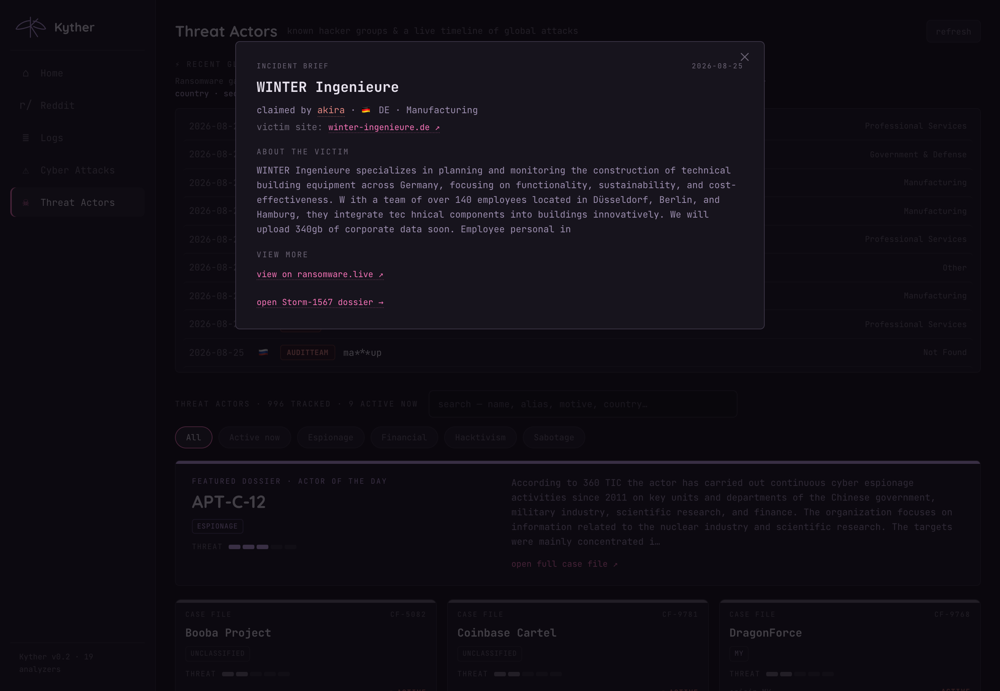
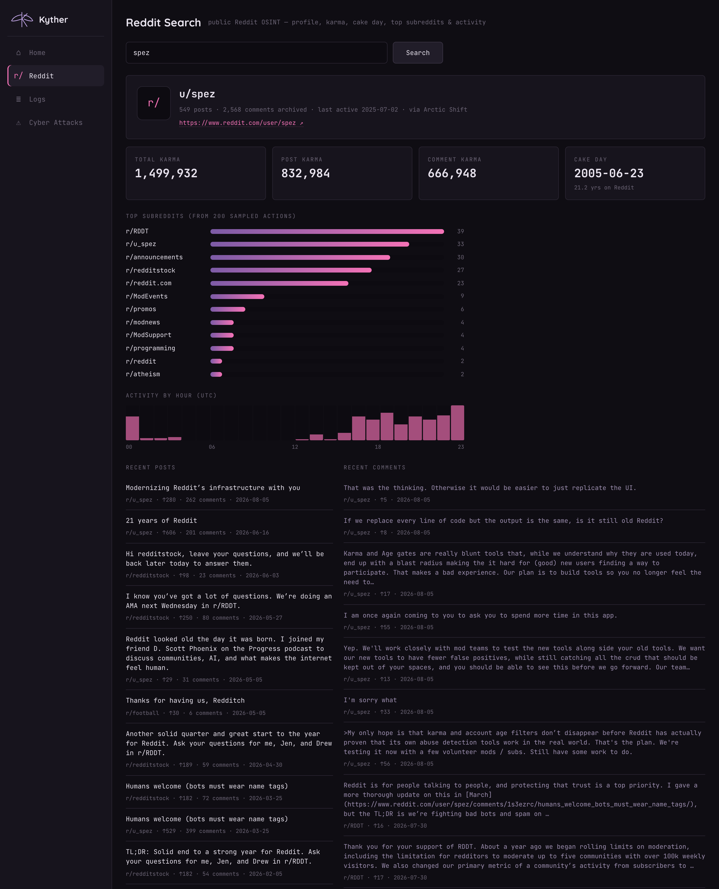
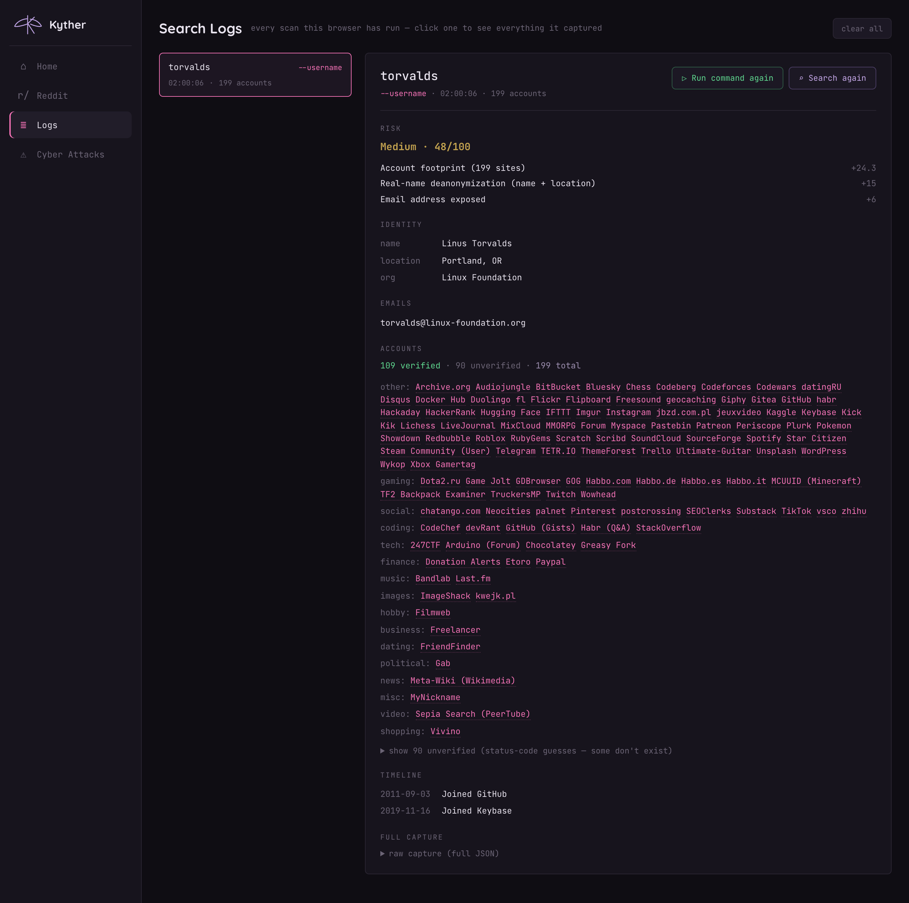
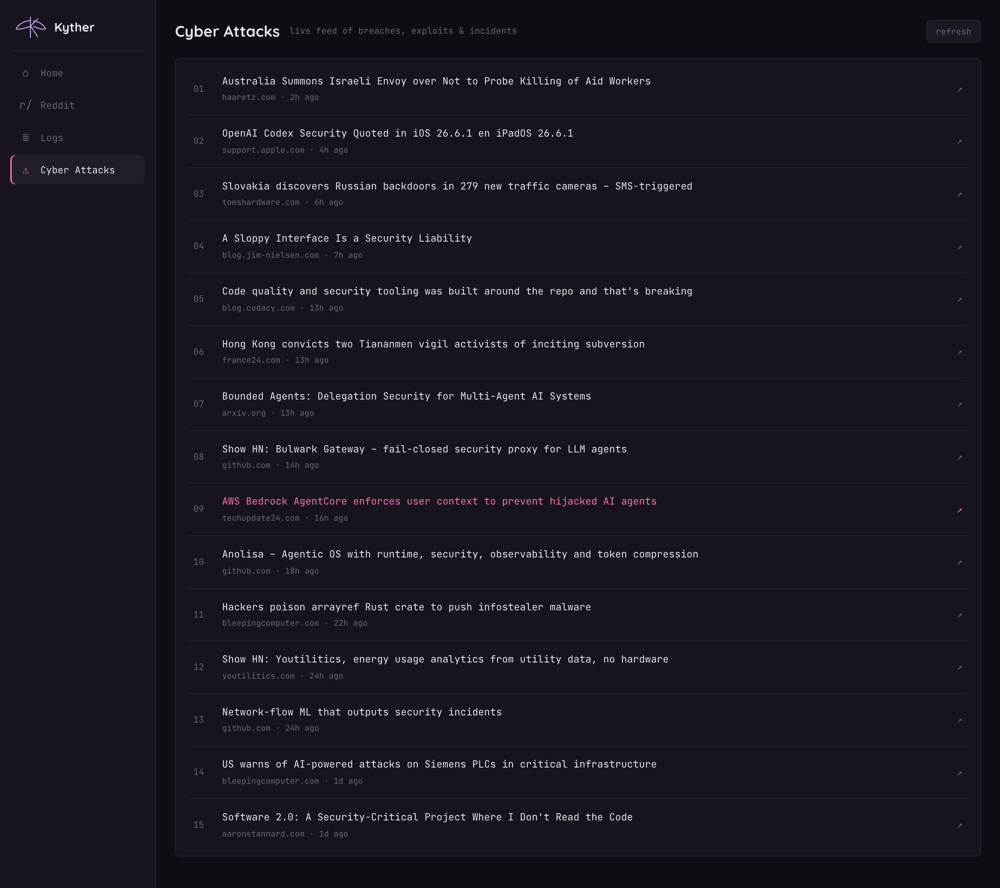

<div align="center">


# Kyther

**intelligence aggregation terminal** — a plugin-based OSINT orchestration engine


</div>

Seed Kyther with an entity — a **username, email, domain, IP, phone, person, or
company** — and it runs every compatible analyzer concurrently, then *pivots* on
what it discovers (username → email → domain, domain → IPs → ASNs, …) up to a
configurable depth. It fuses the results into a single dossier, scores the
subject's exposure, and can export a professional PDF report. That
entity-correlation loop is what makes it an orchestrator rather than a one-shot
lookup — all behind a terminal-style console.



---

## ✦ Features

- **Terminal console** — `search --username <x>` (or `--email`, `--domain`, `--ip`, `--phone`), with `help` and `clear`; results stream back as colored terminal output.
- **19 analyzers, one engine** — username sweeps, profile enrichment, email discovery, breach checks, infra recon, phone intel, Reddit OSINT, and more — merged and deduplicated.
- **Entity pivoting** — a discovered email is re-scanned, a domain expands to its IPs and ASNs, correlated into one result.
- **Confidence-tagged findings** — every result is `confirmed` / `probable` / `possible`, so a status-code guess never masquerades as fact.
- **Risk scoring** — a 0–100 exposure score with a `Low → Critical` tier and its top driving factors, weighted by sensitivity **and** confidence.
- **Professional PDF reports** — one click re-scans the target and renders a multi-section report (cover, executive summary, findings, methodology, appendix). See [`docs/sample-report.pdf`](docs/sample-report.pdf).
- **Reddit OSINT — keyless** — a dedicated section pulls karma, cake day, most-active subreddits, activity patterns and recent posts/comments from public Reddit archives (Arctic Shift + PullPush), including removed/deleted content — **no API key or OAuth**.
- **Searchable logs** — every scan is saved with its full captured dossier; open any past search to see everything it found, then **re-run** it or **search again**.
- **Threat Actors — keyless** — ~1,000 hacker groups as "classified dossier" cards (motive, origin, state sponsor, targets, aliases, heuristic threat rating), plus a live global attack timeline from ransomware.live. Click any incident for a brief; the gang cross-links to its dossier. Sources: MISP galaxy + ransomware.live.
- **Live dashboard** — targets scanned, profiles found, success rate, and a threat level that reacts to the risk score.
- **Cyber Attacks feed** — a live security-news stream (Hacker News, cached).
- **Safety built in** — an SSRF guard blocks private/metadata targets; heavy or keyed analyzers are off by default.

## 🗂 Workspace

The UI is a sidebar workspace (Home is unchanged terminal-first):

| View | What it's for |
|------|---------------|
| **Home** | the terminal console, quick search, live stats, risk tile, PDF export |
| **Reddit** | keyless Reddit OSINT — profile, karma, cake day, top subreddits, activity, posts/comments |
| **Logs** | every past scan; click one for its full dossier + *run again* / *search again* |
| **Cyber Attacks** | live feed of breaches, exploits & incidents |
| **Threat Actors** | hacker groups as dossier cards (motive, origin, threat rating) + a live global attack timeline with incident briefs |

## 📸 Screenshots

**Threat Actors.** ~1,000 hacker groups as classified-dossier cards (motive-coloured, with a heuristic threat rating and an *Active now* badge), a rotating "actor of the day" spotlight, and a live global attack timeline.



**Incident briefs.** Click any ransomware attack for a brief — victim, gang, an "about the victim" write-up, and safe "view more" links. The gang cross-links to its threat-actor dossier.



**Reddit OSINT — keyless.** Profile, karma, cake day, most-active subreddits, activity-by-hour, and recent posts/comments — pulled from public archives with no API key.



**Searchable logs.** Every scan is saved with its full captured dossier; reopen any past search, then *run it again* or *search again*.



**Live Cyber Attacks feed.** A rolling stream of breaches, exploits, and incidents.



## ⚡ Quick start

```bash
git clone https://github.com/Ammu-yuu/Kyther.git
cd Kyther
python3 -m venv .venv && source .venv/bin/activate
pip install -r requirements.txt

uvicorn kyther.api:app --port 8099
# open http://127.0.0.1:8099
```

Enable opt-in analyzers (account-enumeration / keyed) via env vars:

```bash
OSINT_ENABLE_HOLEHE=1 uvicorn kyther.api:app --port 8099
```

## ⌨ The console

| Command | Does |
|---|---|
| `search --username <handle>` | sweep ~700 sites (WhatsMyName + Sherlock) + enrich + find emails |
| `search --email <addr>` | Gravatar, GitHub pivot, breach checks, Holehe* |
| `search --domain <host>` | DNS, RDAP, crt.sh, HTTP fingerprint, Shodan InternetDB |
| `search --ip <addr>` | geolocation, RDAP, open ports / CVEs |
| `search --phone <number>` | offline carrier / region / line-type intel |
| `help` · `clear` | usage · reset the terminal |

> Reddit lookups live in their own **Reddit** view (keyless), not a `search --` command.

## 🖥 CLI

Every analyzer is also scriptable from the terminal:

```bash
python -m kyther.cli scan example.com --depth 2
python -m kyther.cli scan someone@example.com --json
python -m kyther.cli sherlock SakuraSnowAngelAiko   # Sherlock-only username check
python -m kyther.cli holehe test@example.com        # Holehe-only email check
python -m kyther.cli list                           # registered analyzers
```

## 🔌 Analyzers

| Input | Analyzers |
|-------|-----------|
| **username** | WhatsMyName (719 sites) · Sherlock (413) · profile enrichment (GitHub/Keybase/Reddit/HN/Instagram) · GitHub-commit emails · **Reddit archives (keyless)** |
| **email** | Gravatar · GitHub → email pivot · Holehe\* · HIBP\* · EmailRep\* |
| **domain / IP** | DNS · RDAP · crt.sh · HTTP probe · Shodan InternetDB · IP geolocation · Hunter\* |
| **phone** | offline `phonenumbers` intelligence |
| **company** | SEC EDGAR full-text search |
| **person** | investigative search links |

`*` = needs a free key or an opt-in flag; **off by default**. Run `python -m kyther.cli list` to see each analyzer's status.

## 🧠 How it works

```
seed entity ─► orchestrator ─► [analyzers accepting this type] ─► findings
                    ▲                                              │
                    └──────────── discovered entities ◄────────────┘
                              (depth-limited BFS pivot)

findings ─► confidence tagging ─► dossier + timeline + graph ─► risk score ─► (PDF)
```

- **`kyther/core/`** — entity model, plugin registry, async pivot engine, SSRF guard.
- **`kyther/analyzers/`** — one file per source. Add a plugin by dropping a module here and listing it in `__init__.py`.
- **`kyther/api.py`** — FastAPI service: `/api/scan`, `/api/report` (PDF), `/api/reddit`, `/api/threats`, `/api/news`, `/api/analyzers` + the console.
- **`kyther/report.py`** — the reportlab PDF report generator.
- **`kyther/web/index.html`** — the self-contained Kyther workspace UI.

## ⚖ Scope & ethics

Kyther uses only **public, no-auth data** (or an optional bring-your-own key you
supply). No auth bypass, no paywalled scraping, no captcha-solving. Account
enumeration and email-registration checks are **opt-in**. Reddit data comes from
public archives, not scraping logged-in sessions. Use it only against targets
you're authorized to investigate — authorized security research, CTFs, and
education.

## Design system

Terminal/data content in **JetBrains Mono**, the brand title in **Quicksand**.
Palette: page `#0f0d13`, panels `#17141d`, borders `#2a2532`, accent `#f472b6`
(reserved for the prompt, cursor, and match tags), success `#5fd88f`.
